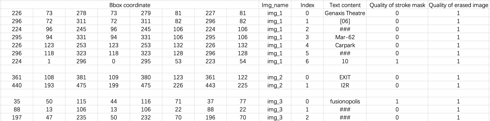

# DecompST

This repository hosts the DecompST dataset from the following work:

**A Scene-Text Synthesis Engine Achieved Through Learning from Decomposed Real-world Data** | [IEEE Xplore](https://ieeexplore.ieee.org/document/10299591)

Zhengmi Tang, Tomo Miyazaki, and Shinichiro Omachi.

Graduate School of Engineering, Tohoku University

You find the dataset generation code in this [Repo](https://github.com/tzm-tora/Learning-based-scene-text-engine).

## Dataset Description
DecompST is a quadruplet of original scene text images, text BBoxes, text-erased images, and stroke-level text masks. This dataset is made by Decomposing real-world Scene Text images into pure background images and text instances. It can be utilized to train a robust network to learn the complicated layout and the appearance of text instances in real-world scene images. 
All of the images in our dataset are collected from ICDAR2015, ICDAR2017-MLT, and TextSeg.


## Download
Our dataset (DecompST) is academia-only and cannot be used on any commercial project or research. To download the data, please send a request email to us and tell us which school you are affiliated with.

Our dataset contains:
* ```annotation.txt``` contains the original ICDAR2015-style annotation with another two labels (quality of text-stroke mask and quality of text-erased image) for each text-instance.
  * For the pixel mask image, the quality of each text instance is divided into three ranks. The text perfectly masked is labeled by 1. The text that is too small to recognize or too complicated to mask is labeled by 0. Texts which are partially masked or near to perfect are labeled by 3. 
  * For the text-erased image, the quality of each text instance is also divided into three ranks. The text which is perfectly erased is labeled by 1. For the erasing result of text is bad, whose labels are 0. Texts that are partially erased or the result is close to perfect are labeled by 3.
* ```text_erased``` contains text-erased images.
* ```stroke_mask``` contains a stroke-level mask of text instances. 0 means background, 255 means text.
* ```src``` contains the original images.
* ```text_pixel``` contains text-pixel images, which can be generated by original images and stroke-level masks.

Text instances achieved 1 on both sides will be picked up as valid data (about 16000 text instances from 4585 different images).



## Citation and Contact

Please consider to cite our paper when you use our dataset:
```
@article{LBTS2023tang,
  author = {Tang, Zhengmi and Miyazaki, Tomo and Omachi, Shinichiro},
  journal = {IEEE Transactions on Image Processing},
  title = {A Scene-Text Synthesis Engine Achieved Through Learning From Decomposed Real-World Data},
  year = {2023},
  volume = {32},
  pages = {5837-5851}
}
```

For any questions about the dataset please send an email to Dr. Tang (tzm@dc.tohoku.ac.jp), Asst Prof. Miyazaki (tomo@tohoku.ac.jp), or Prof. Omachi (machi@ecei.tohoku.ac.jp).


## Acknowledgements
Some of our data are directly from [TextSeg dataset](https://github.com/SHI-Labs/Rethinking-Text-Segmentation). Thank you for the excellent work.
